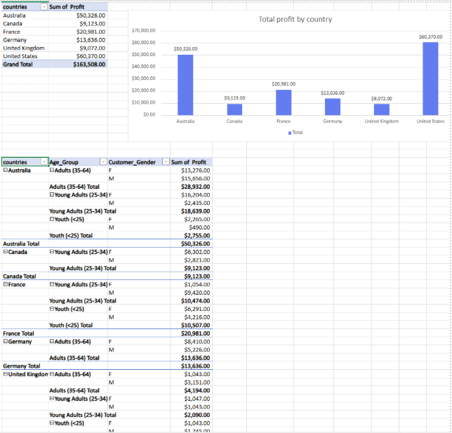
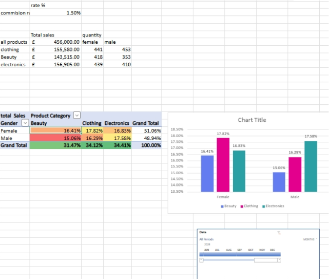

# 📊 Excel Retail & Sales Analysis Project

## 📌 Project Overview

This project was completed as part of a **Data Technician Bootcamp** and focuses on analysing **retail and sales data using Microsoft Excel**. The aim was to clean, analyse, and visualise data to extract meaningful business insights and support data-driven decision-making.

The project demonstrates strong foundational and intermediate Excel skills commonly used in data technician and analyst roles.

---

## 🛠️ Skills & Tools Used

### 🔢 Excel Formulas & Functions

* **Basic calculations:**

  * `SUM`, `AVERAGE`
* **Conditional calculations:**

  * `SUMIF`, `AVERAGEIF`
* **Date handling:**

  * `DATE`, `MONTH`, `YEAR`
* **Data lookup & categorisation:**

  * `VLOOKUP`
  * `SWITCH`
* **Data cleaning & exploration:**

  * `UNIQUE`

---

### 🔍 Data Analysis Techniques

* Filtering and sorting datasets to identify trends and patterns
* Creating **PivotTables** to:

  * Summarise sales by product, category, and time period
  * Compare performance across different months and years
  * Analyse total and average sales metrics

---

### 📈 Data Visualisation

* Built clear and effective **charts** to present insights, including:

  * Sales trends over time
  * Product and category performance comparisons
  * Summary views derived from PivotTables
 
  
### Profit Analysis

---

## 📂 Dataset

* Retail and sales transaction data
* Included fields such as dates, products, categories, and sales values
* Data was prepared and structured to support accurate analysis

### Category Analysis

---

## 🎯 Key Outcomes

* Improved understanding of Excel as a data analysis tool
* Ability to transform raw data into structured insights
* Developed confidence using formulas, PivotTables, and charts for real-world business scenarios

---

## 🚀 Next Steps

* Replicate the analysis using Power BI or Python
* Automate reporting with dashboards
* Apply similar techniques to larger datasets

---

📌 *This project showcases practical Excel skills relevant to entry-level data roles, including data cleaning, analysis, and visualisation.*
